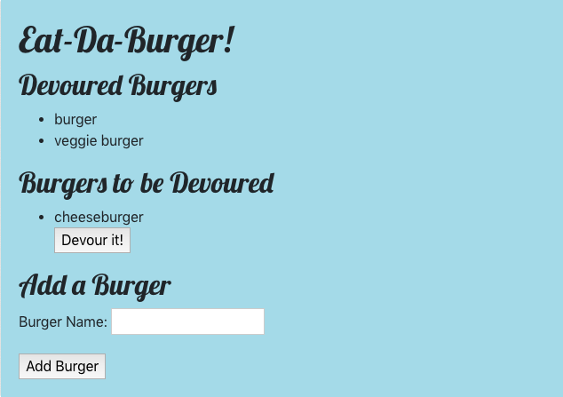

# burger

This is a full stack restaurant application. It allows customers or people in the restaurant industry to add burgers to a database and to keep track of which ones have been eaten. Whether the user is a foodie keeping tack of what they want to eat or somebody working in or managing a burger-oriented restaurant, this app can help.

Technologies used: JavaScript, JQuery, HTML, Handlebars, CSS, Bootstrap, Node.js, SQL and MySQL

To use the app, follow these steps:
1. Clone the repository with the following command: git clone https://github.com/TomStone76/burger.git
2. Make sure you have Node.js (https://nodejs.org/en/) and MySQL installed (https://www.mysql.com/).
3. Visit the db folder of this project. Create the "burger" database by pasting the code from schema.sql into a new MySQL file. Populate the database with the code from seeds.sql.
4. After making sure that your MySQL connection is active, go to the config folder of the repository. Enter your port, username, and password. Save these changes.
5. Run the app by typing this command in the terminal: node server.js

